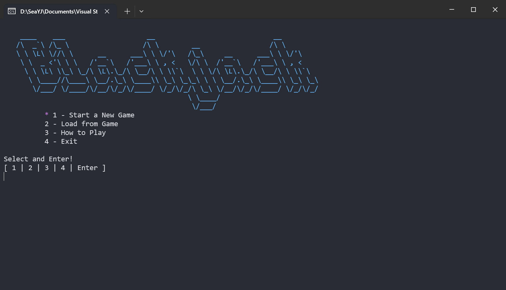

# ♠️ Blackjack (Cpp)


这个代码库是我接手的外包项目之一。但因为我非常喜欢这个项目的主题，我决定全力投入编写代码，并借此机会提升我的C++技能。这个项目不仅让我非常有成就感💪，也是一个绝佳的学习机会📚，希望对你的学习也有所帮助🤓。

# 项目计划目标

- [x] **人机对弈**
- [x] 游戏存档/读档
- [x] 游戏玩法说明

# 编程感悟

最开始这个项目是我为其他同学做的实验作业，但是我觉得这是个非常棒的练手项目。

于是，我从类的高度对这个项目进行了设计。我希望能提高项目中所有类的“**复用性**”，从而提高项目的价值。

这期间，我深刻感悟写代码前**一定要做好顶层设计**，或者你能全身心地投入开发并一次性完成代码（我指的是不要长时间暂停编写一个项目），否则你的遗忘会让你在没有对项目进行顶层设计时使你失去对项目的了解与感知，从而导致“代码风格”的极大差异。也正因此，偏大一点的项目就会出现很多 BUG 及不可预期问题（中间暂停了快半个月，后面续写时快崩溃了）。

还有，**不要长时间去编写同一个项目**。应该保持编程的过程，但是增加大脑接触的内容的多样性。这样有利于获取更多的开发灵感和奇思妙想，至少我认为这样非常有用。

总的来说，***这个项目设计还有很多缺陷***（大概跟我边写边设计的习惯有关，这是一个很不好的习惯）。其中，我尤其感觉这个项目中对**异常的处理**及**返回值处理**方面有很大问题。当然，我后续会继续学习，如果有时间可能会回头修改此项目。

# 其他说明

这个项目本来就是个作业级的，只是我将其复杂化（可能我希望它被写的更好、更优秀）了。

所以，如果你需要将其作为你的作业，我也很高兴你能认可它。

里面唯一需要修改的是在

```CPP
BlackjackGame& BlackjackGame::GameManual() {}
```

函数里的内容，因为那里包含我的网名。如果你介意，可以将其删除！

或者你可以为我的项目**点个小星星**吧！

# 运行截图



